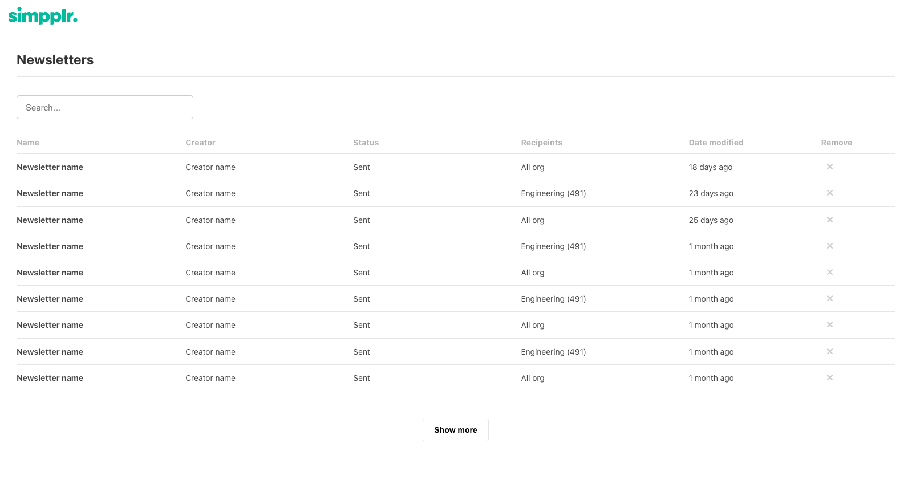

# Welcome to the Simpplr automation test exercise

We've included an example project for you to run. This is a simplified version
of a part of our application.

## What do we want you to do?

1. Write Cypress end-to-end tests to test the behaviour of the application
   against the user story.
2. We expect the test to fail if the application does not do as the story states.
3. Find any differences between the design and the app, and them as a list to
   comments in the pull request.

Feel free to add any aria attributes, ids etc to the react components if it helps you write better end-to-end tests.

## What are we looking for?

We'll be judging you on the following:

- Clear, concise, readable JavaScript or TypeScript - use whatever you're most comfortable with.
- Robust tests that cover more than just the happy path.

## Before you begin

Firstly, **create a branch for your work** - you will be submitting via a Pull Request so it's important you work in a separate branch. It doesn't matter what you call it.

This repository fork has been created specifically for you - no other candidates will be able to see your work.

The rules for this exercise are as follows:

1. We’ve set Cypress up for you already but if you want to add another integration testing framework thats fine.
2. Feel free to use 3rd party libraries to help you
3. Try to make small, atomic commits (i.e. for each change) so we can see how you work more easily
4. Don't spend more than 2 hours on this exercise

## Running the application

After you've cloned your branch locally, you need to run it. We use Yarn as our package manager of choice. We've setup some scripts to get you started:

```
# install dependencies
yarn

# run the application
yarn start

# open cypress
yarn cypress:open

# run tests headless with mochawesome reports (in chrome)
yarn cypress:run-chrome

# run tests headless with mochawesome reports (in edge)
yarn cypress:run-edge

```

## Submitting your work

When you're ready to submit you should create a Pull Request to merge your
branch into main.
Once you've made the Pull Request, feel free go through the diff and add any inline comments to explain your thinking and approach to solutions.

Once that's done, send a link to the pull request to your interviewer so we know your work is ready to be reviewed.

## User story

- As a user I want to view a list of all draft and sent newsletters.
- I want to be able to search for a newsletter by any of the columns, via a case
  insensitive string input.
- I don't want to see too many newsletters when I load the page, so I want to
  see 10 newsletters and then a show more button, upon clicking will load another 10 if
  available. The button should hide if there are no more results.
- I should be able to delete emails that have not been sent yet.

## Design


